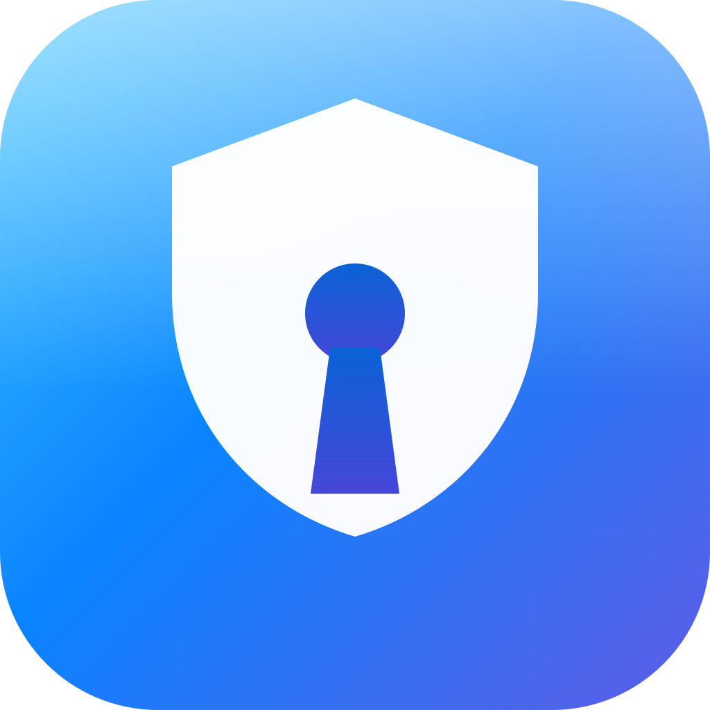
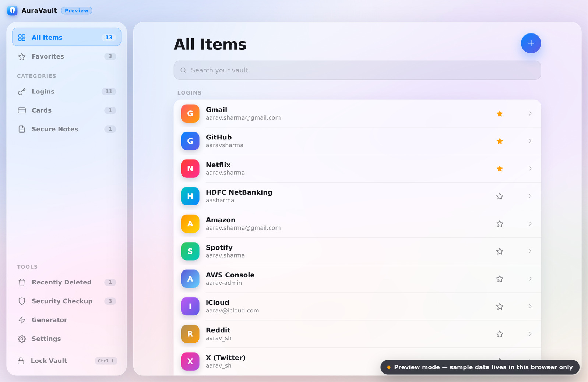
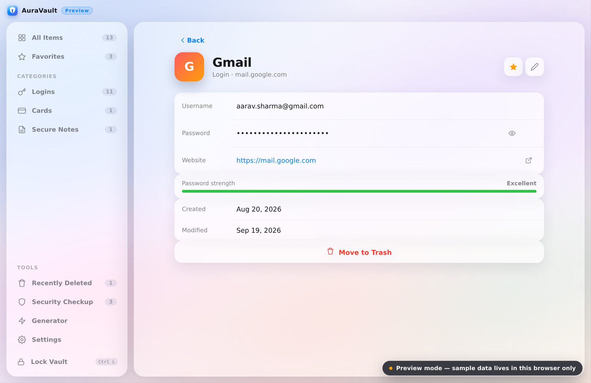
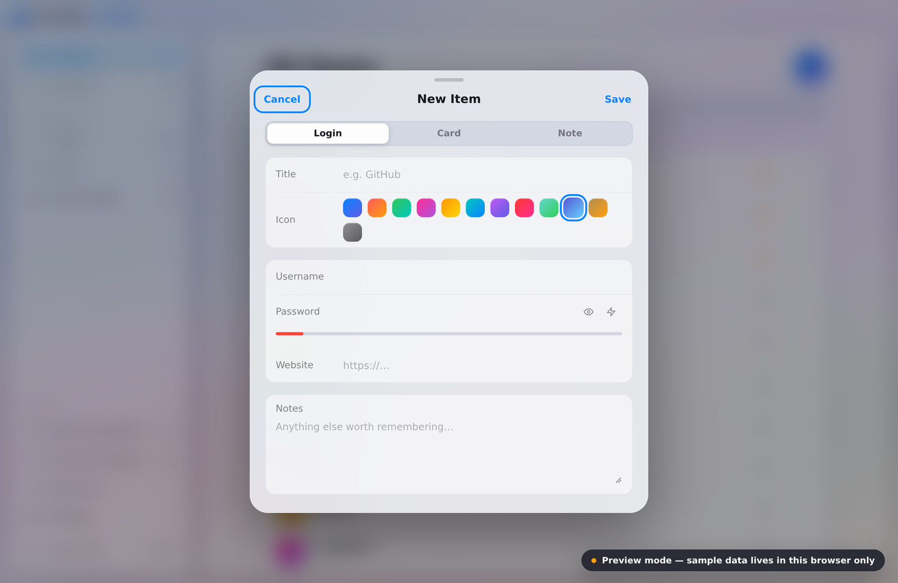
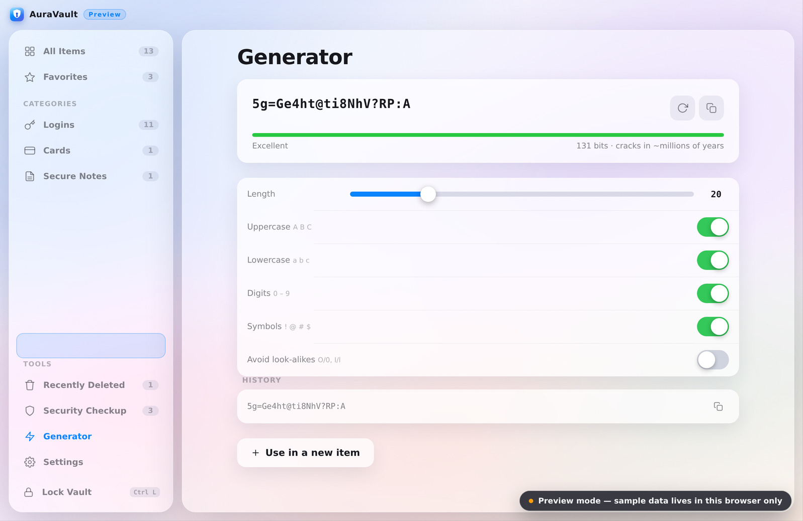
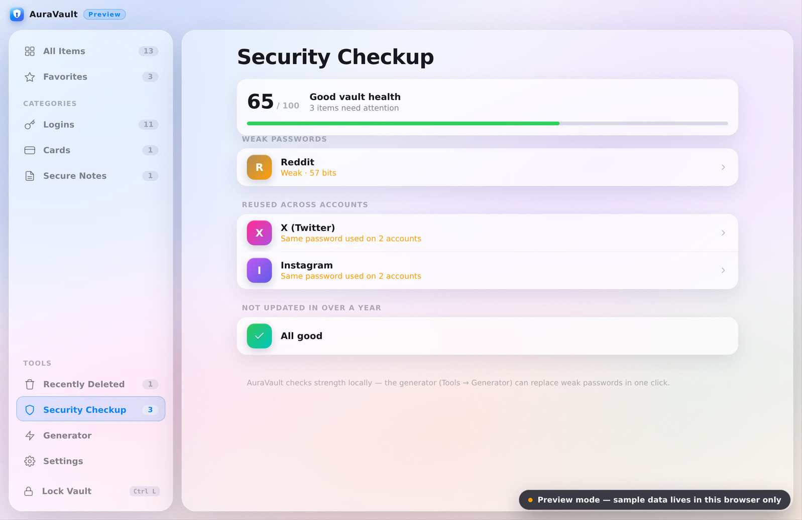
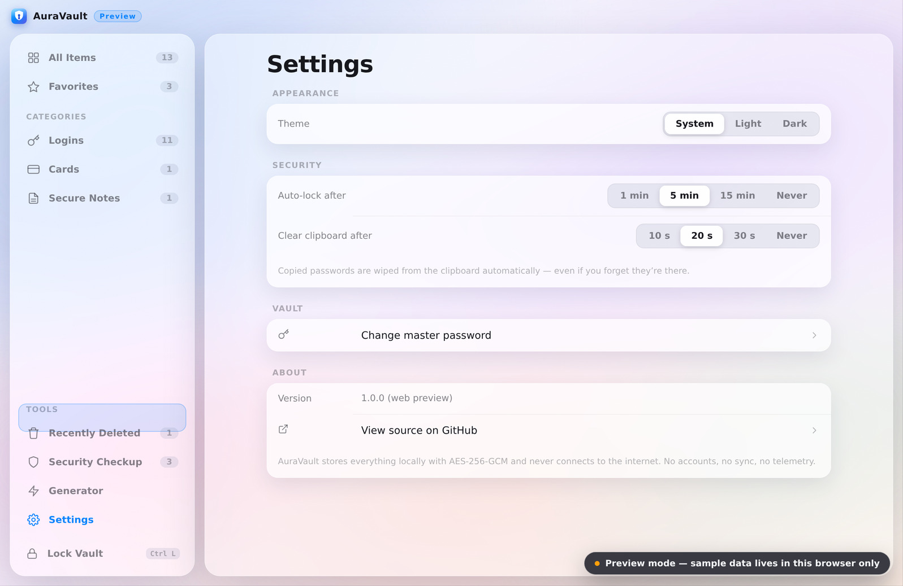
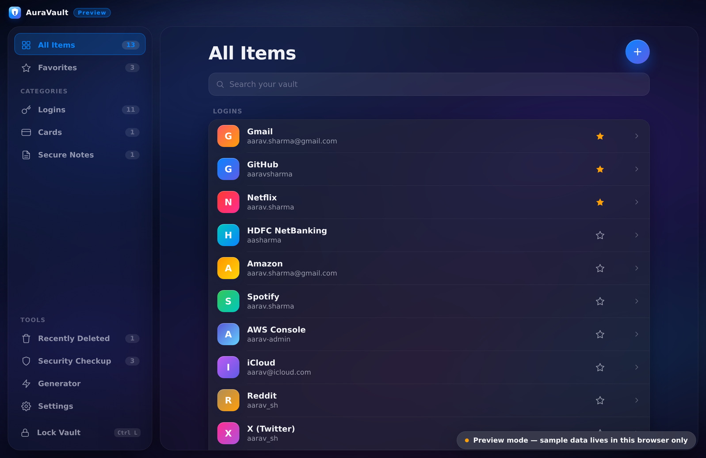
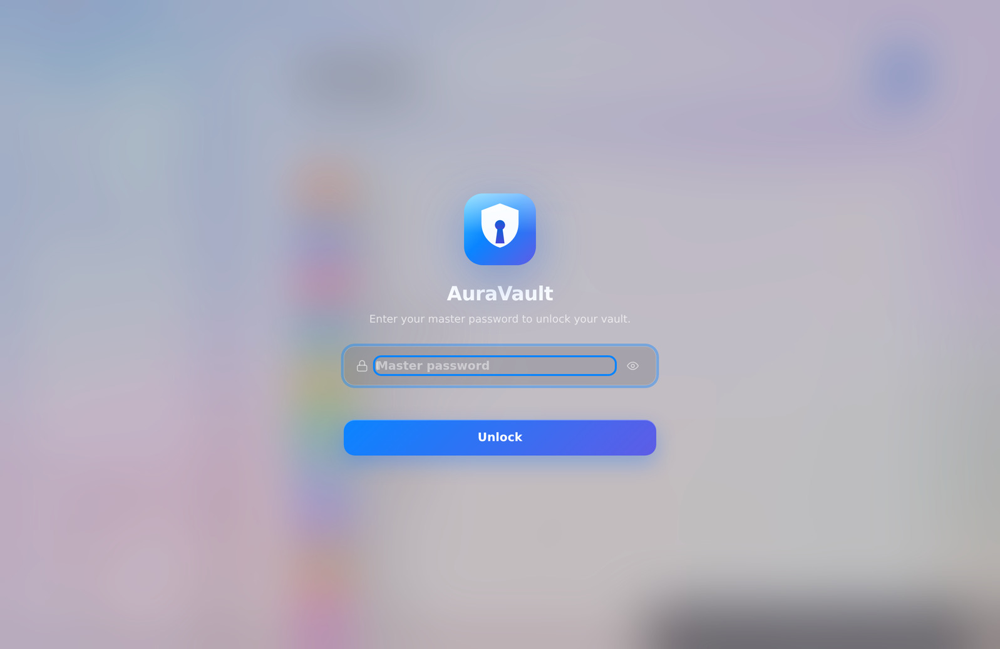

<div align="center">



# AuraVault

**A beautifully secure password manager for Windows.**

iOS-inspired glass design · AES-256-GCM zero-knowledge encryption · buttery-smooth animations

[](LICENSE)
[](#-install)
[](https://www.electronjs.org)
[](CONTRIBUTING.md)

<a href="https://your-username.github.io/auravault/demo/"></a>

**[Live UI preview →](https://your-username.github.io/auravault/demo/)** · **[Download the installer →](#-install)**

</div>

---

## ✨ Highlights

|  |  |
| --- | --- |
| 🔐 **Real security** | Your vault is encrypted with **AES-256-GCM**; the key is derived from your master password with **scrypt** and never leaves memory. No cloud, no accounts, no telemetry — the app contains **zero network code**. |
| 🪟 **Premium glass design** | Frosted panels that blur a living wallpaper, inset-grouped lists, large titles, segmented controls, switches — a faithful iOS design language on Windows, in light **and** dark. |
| 🎬 **Smooth everywhere** | Spring-based motion for every transition: opening & closing the app, pushing pages, modal sheets, adding & removing rows, toasts, the sliding sidebar pill. |
| 🗂 **Three item types** | Logins, payment cards (with formatting & masked reveal) and secure notes — each with a colored icon, favorites and search. |
| ⚡ **Password generator** | CSPRNG-based, live strength meter with entropy in bits and offline crack-time estimates, history of the last five. |
| 🗑 **Recently Deleted** | Deleted items rest for 30 days with one-click undo and restore. |
| 🩺 **Security Checkup** | Local audit for weak, reused and stale passwords with a vault health score — the analysis never leaves your PC. |
| 📋 **Clipboard hygiene** | Copied secrets auto-wipe from the clipboard after a countdown. |
| ⏱ **Auto-lock** | Locks after inactivity or when you lock your Windows session. |
| 💾 **Encrypted backup & restore** | Export the whole vault as a single encrypted `.avault` file; import it on any machine. |

## 📸 The app

| Home | Detail |
| --- | --- |
|  |  |

| New item sheet | Generator |
| --- | --- |
|  |  |

| Security Checkup | Settings |
| --- | --- |
|  |  |

| Dark mode | Lock screen |
| --- | --- |
|  |  |

## 📥 Install

### One-click installer (recommended)

1. Grab **`AuraVault-Setup-1.0.1.exe`** from the [latest release](https://github.com/your-username/auravault/releases/latest).
2. Double-click it. That's it — no wizard, no admin rights, no UAC prompt.
3. AuraVault installs per-user, adds Desktop + Start Menu shortcuts, and launches.

> **SmartScreen note:** the installer is unsigned (no code-signing certificate — they cost hundreds of dollars a year). On first run Windows may show *"Windows protected your PC"*. Click **More info → Run anyway**. Every release is built reproducibly by the public [GitHub Actions workflow](.github/workflows/build.yml) — the exe you download is the exact artifact that build produced.

### Portable version

Prefer no install at all? `AuraVault-Portable-1.0.1.exe` runs standalone from anywhere, USB sticks included.

## 🔒 Security model

```
master password ──scrypt(N=16384, r=8, p=1)──▶ 256-bit key
                                                    │
              ┌─────────────────────────────────────┘
              ▼
   AES-256-GCM ─▶ vault.avault  (single file, 0600, in %APPDATA%\AuraVault)
```

- **Zero-knowledge**: the key exists only in main-process RAM while unlocked; it is wiped on lock, quit and Windows session lock. Nothing decryptable is ever written to disk besides the encrypted vault.
- **Tamper-evident**: GCM authentication means a wrong password — or a corrupted/edited vault file — fails cleanly instead of decrypting garbage.
- **Sandboxed renderer**: the UI runs with `contextIsolation` + `sandbox`, Node disabled, and a strict CSP. It can only talk to the main process through a tiny, explicitly allow-listed IPC bridge.
- **No network**: the app never makes a network request. There is no sync, no account, no crash reporting, no analytics.
- **Input hardening**: every field is length-capped and sanitized before it touches the vault.

Full details and responsible disclosure: [SECURITY.md](SECURITY.md).

> ⚠️ **There is no recovery.** If you forget your master password, the vault cannot be opened — by you or by anyone else. Keep an encrypted backup (Settings → Export) somewhere safe.

## ⌨️ Keyboard shortcuts

| Shortcut | Action |
| --- | --- |
| `Ctrl + N` | New item |
| `Ctrl + F` | Search the vault |
| `Ctrl + L` | Lock immediately |
| `Esc` | Close sheet / go back |

## 🛠 Building from source

```bash
git clone https://github.com/your-username/auravault.git
cd auravault
npm install

npm start        # run the app in dev
npm run dist     # build the Windows installer + portable exe (dist/)
```

Cross-compiling from Linux/macOS works too — `electron-builder` uses Wine for the
Windows-specific packaging steps. On a real Windows machine no extra tooling is needed.

Extra development scripts:

| Command | What it does |
| --- | --- |
| `npm run icons` | regenerates `resources/icon.*` from `src/assets/logo.svg` |
| `npm run shots` | full E2E run of the real app on a virtual display (`xvfb-run`) with DOM assertions |
| `npm run shots:web` | captures the documentation screenshots with headless Chromium |
| `npm run dist:portable` | builds only the portable exe |

### CI

Every push runs [Build AuraVault](.github/workflows/build.yml) on `windows-latest` and uploads the
installer + portable exe as artifacts. Tagging a release (`v1.0.1`) attaches both exes to a
GitHub Release automatically.

## 🏗 Architecture

```
main.js            Electron main process — crypto core, vault file, IPC, auto-lock,
                   clipboard hygiene, window lifecycle. Zero dependencies.
preload.js         Allow-listed contextBridge API (contextIsolation + sandbox on)
src/
  index.html       single window, strict CSP
  styles.css       the whole design system — tokens, glass, springs, light/dark
  js/boot-theme.js pre-paint theming (no flash)
  js/api.js        window.vault → Electron IPC, or a localStorage demo adapter in browsers
  js/util.js       DOM helpers, icons, toasts, strength heuristics
  js/ui.js         sheets, action sheets, segmented controls, page transitions
  js/views.js      home / detail / generator / settings / trash / lock / setup
  js/app.js        boot, routing, sidebar, shortcuts, activity tracking
scripts/           icon pipeline, E2E + screenshot suites
```

No frontend framework, no build step for the UI, no runtime dependencies — the app itself is
pure platform code, which keeps the supply chain (and the review surface) tiny.

## 🤝 Contributing

Issues and pull requests are welcome! See [CONTRIBUTING.md](CONTRIBUTING.md) for the dev setup
and the E2E test suite.

## 📄 License

[MIT](LICENSE) — free to use, study, modify and distribute.

---

<div align="center"><sub>Made with 🖤 for people who like their secrets both safe and pretty.</sub></div>
